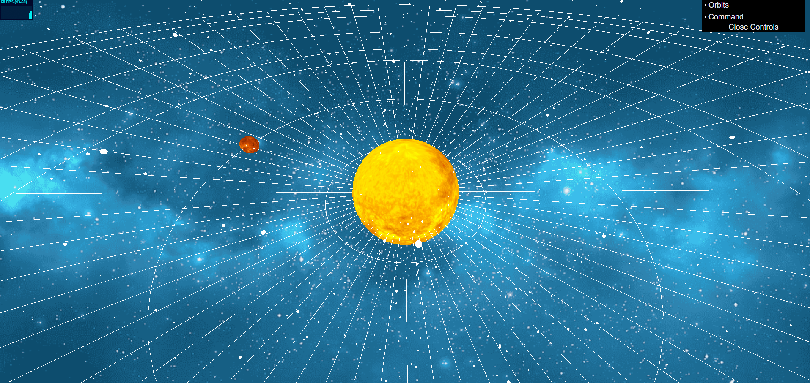

# Galaxy-3D

Galaxy-3D è un progetto che simula la Via Lattea con pianeti che orbitano attorno al Sole, implementato utilizzando Three.js, TypeScript, Node.js e Webpack.

## Descrizione del Progetto

Il progetto ha lo scopo di fornire una visualizzazione animata e interattiva del nostro sistema solare, mostrando la Via Lattea e i pianeti che orbitano attorno al Sole.



## Tecnologie Utilizzate

- **Three.js**
- **TypeScript**
- **Node.js**
- **Webpack**

## Istruzioni per l'Installazione e l'Esecuzione

1. **Clona il Repository:**
   ```bash
    git clone https://github.com/danielepalomba/Galaxy-3D.git
    cd Galaxy-3D

2. **Installa le Dipendenze:**
    ```bash
    npm install

3. **Avvia l'applicazione:**
    ```bash
    npm run dev

4. **Apri il browser e recati al seguente indirizzo: http://localhost:8080/**
